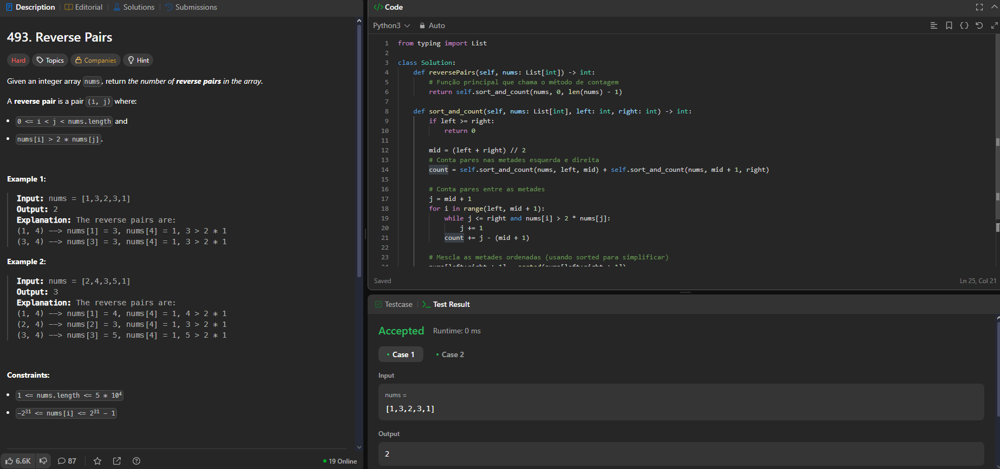

# Dividir e Conquistar Leetcode

**Conteúdo da Disciplina**: Dividir e Conquistar<br>

## Alunos
|Matrícula | Aluno |
| -- | -- |
| 211031744  |  Júlio César Costa |
| 211031403  |  Marcus Vinicius Cunha Dantas |

## Sobre 
Este projeto visa resolver questões do leetcode relacionadas a algoritimos Dividir e Conquistar com dificuldades médias e difíceis

| Problema | Nome                                                                                        | Dificuldade |
|----------|---------------------------------------------------------------------------------------------|-------------|
| 1382     | [Balance a Binary Search Tree](https://leetcode.com/problems/balance-a-binary-search-tree/) | Médio       |
| 23       | [Merge K sorted Lists](https://leetcode.com/problems/merge-k-sorted-lists/)                 | Difícil     |
| 215      | [Kth Largest Element in an Array](https://leetcode.com/problems/kth-largest-element-in-an-array/description/)  | Médio       |
| 493      | [Reverse Pairs](https://leetcode.com/problems/reverse-pairs/description/)                   | Difícil     |

## Apresentação

[Apresentação no Youtube](https://youtu.be/UNXOpTC8drA)

## Screenshots

### [Balance a Binary Search Tree](https://leetcode.com/problems/balance-a-binary-search-tree/)


### [Merge K sorted Lists](https://leetcode.com/problems/merge-k-sorted-lists/)


### [Kth Largest Element in an Array](https://leetcode.com/problems/kth-largest-element-in-an-array/description/)


### [Reverse Pairs](https://leetcode.com/problems/reverse-pairs/description/)




## Instalação
### Pré Requisitos
Python3.12+
### Comandos
#### Clonagem do Repositório
```git clone https://github.com/projeto-de-algoritmos-2025/DC_Leet.git```
#### Execução
```cd ./DC_Leet```<br>
```python3 [NOME-ARQUIVO].py```


